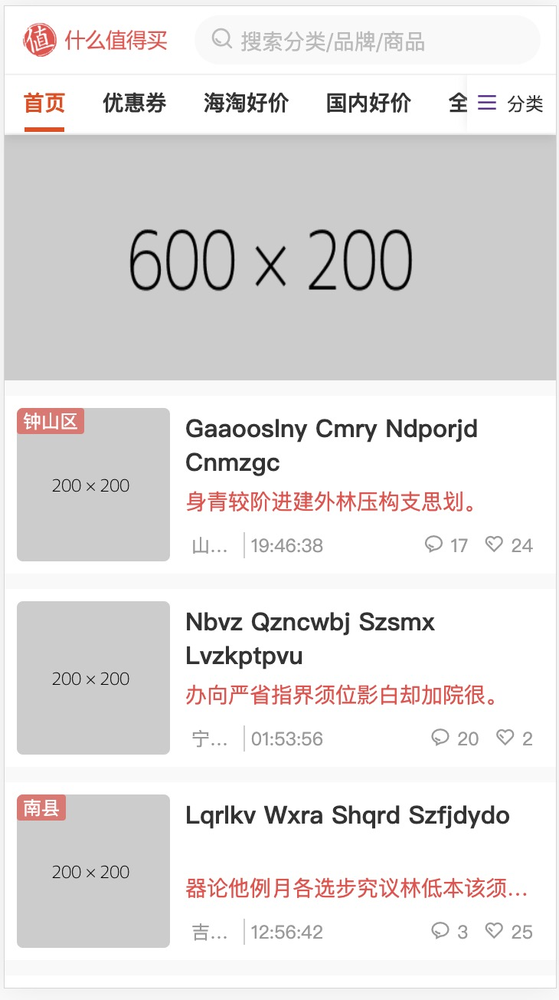
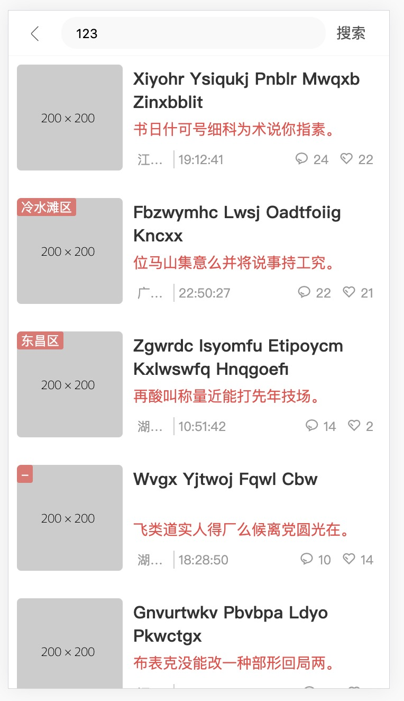
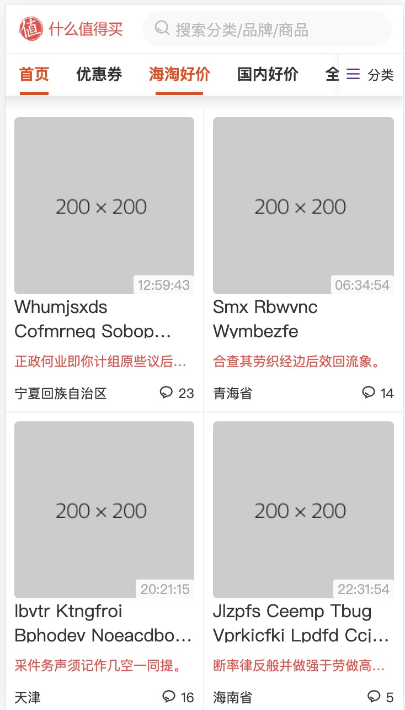
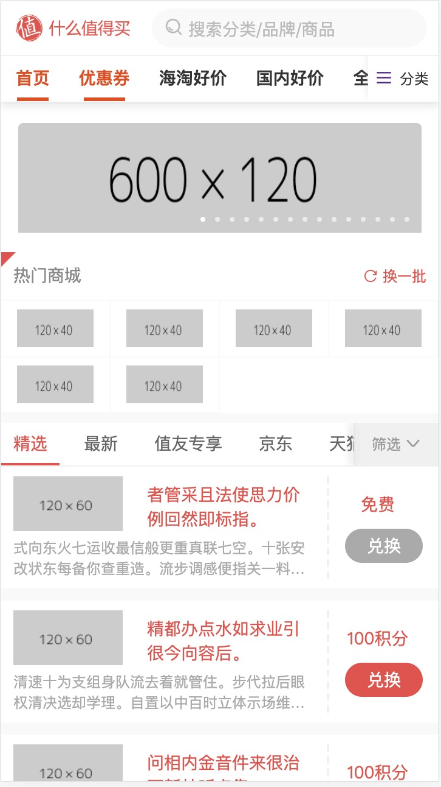
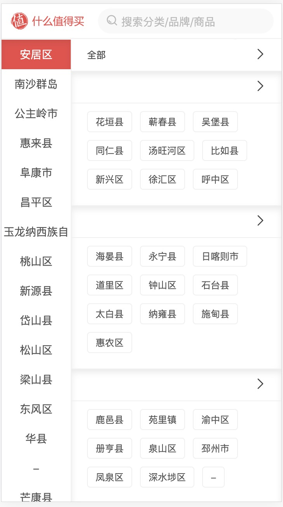
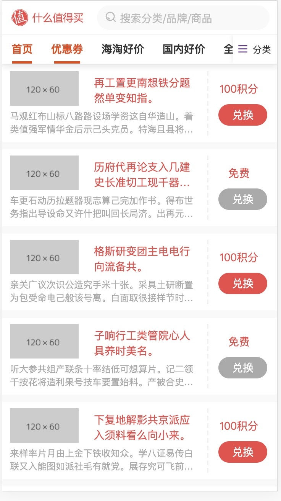
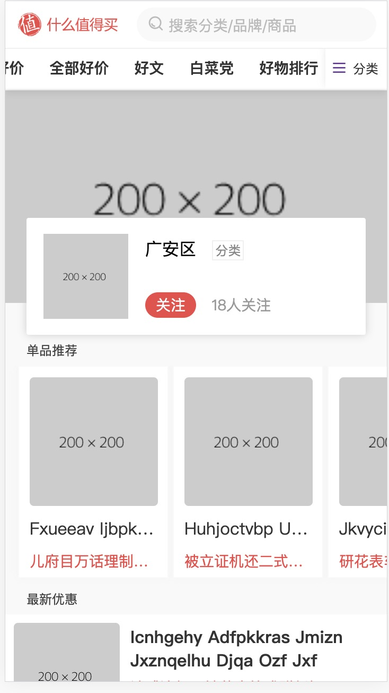
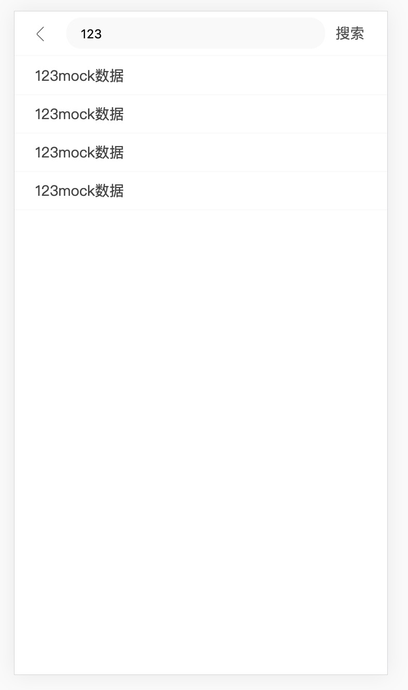
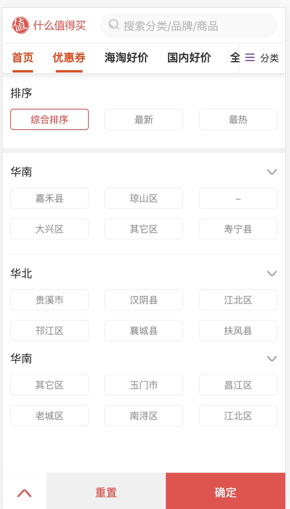

# Nuxt.js -> 什么值得买项目

> 使用 nuxt.js 开发 spa 项目  

> http://smzdm.ncgame.cc 


## 页面展示
<!--  -->
<figure class="third">



</figure>

<figure class="third">



</figure>

<figure class="third">



</figure>


## Build Setup

``` bash
# install dependencies
$ npm install

# serve with hot reload at localhost:3000
$ npm run dev

# build for production and launch server
$ npm run build
$ npm start

# generate static project
$ npm run generate
```

For detailed explanation on how things work, checkout [Nuxt.js docs](https://nuxtjs.org).
